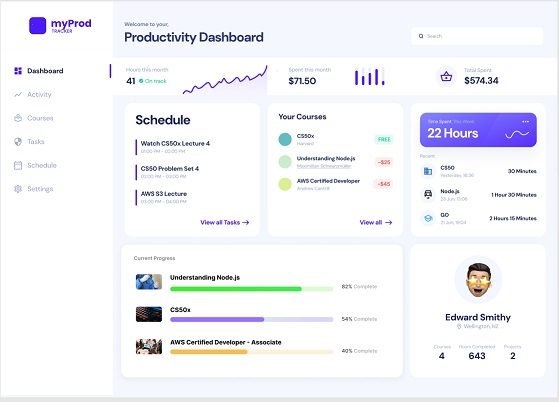

# Productivity Dashboard

## Overview

This project is a full-stack web application featuring a Go backend and a React frontend. It is currently under active development, with ongoing improvements and feature additions. The primary goal is to integrate modern backend and frontend technologies to create a robust personal productivity tracker.

Users will be able create and schedule tasks, register and track progress through courses, log hours spent on completed tasks, monitor expenses on courses, manage projects and notes, and gain insights into their productivity through a detailed breakdown of their activity.

Below is the first milestone - 3 of 8 widgets have been completed so far with functional api end points and database querying.
For more details see the [Roadmap](#roadmap) section at the end of the ReadMe.



## Key Features

- **Go Backend:**

  - RESTful API with routing managed by `chi`.
  - Database connection using Go's `database/sql` package.

- **ReactTS Frontend:**

  - Data fetching and state management powered by React Query.
  - User interface built using React components and Bootstrap.

## Development Status

This project is under active development. New features and improvements are added regularly, with progress documented through commit history.

## Notable Achievements

- Established communication between Go backend and React frontend.
- Implemented basic API routes in Go.
- Set up data fetching and state management in React using React Query.
- Rendered data using nivo charts

## Project Size

This project is a medium to large-sized project, with a significant number of commits and a well-structured codebase. The project consists of:

- 10+ Go files
- 15+ React components
- 5+ API endpoints

## Roadmap

### Short-term goals

- **Complete Dashboard Development**
  - Finish implementing the remaining 5 widgets
  - Integrate all widgets with the React frontend
- **Add Tests for Dashboard and API Endpoints**
  - Write unit tests and integration tests for the dashboard components
  - Write API endpoint tests to ensure correct functionality and error handling
- **Implement Data Validation**
  - Add input validation for user data to prevent errors and inconsistencies
  - Implement data normalization and sanitization to ensure data quality

### Mid-term goals

- **Implement Authentication and Authorization**
  - Add user authentication using OAuth or JWT
  - Implement role-based access control for different features and API endpoints
- **Enhance Data Visualization**
  - Explore additional data visualization libraries or features to enhance the dashboard
  - Implement interactive visualizations to enable users to explore data in more detail

### Long-term goals

- **Refine Application Performance and Scalability**
  - Optimize database queries and API endpoint performance
  - Implement caching and load balancing to improve scalability

- **Deploy Project**

## Installation

To see a current version of the project:

1. Clone the repository: `git clone https://github.com/LB-developer/my-productivity.git`

2. Install dependencies:

- Backend:

  - Install Go dependencies:
    ```
    go mod download
    ```

- Frontend:
  - Install Node.js dependencies:
    ```
    cd client
    npm install
    npm audit fix
    ```

3. Start the development server:

- Backend:

  - Start the Go server:
    ```
    cd cmd
    go run main.go
    ```

- Frontend:

  - Start the React development server:
    ```
    cd client
    npm run dev
    ```

4. View Project

- Open `http://localhost:5173/` in your favorite browser
